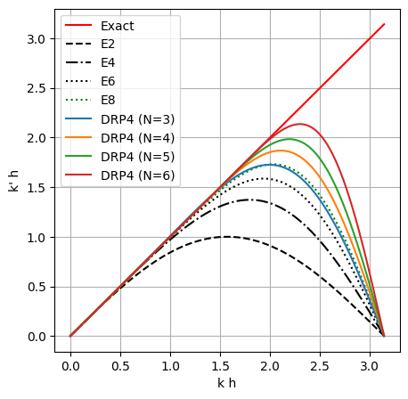

# Dispersion-Relation-Preserving (DRP) Finite Differences

This repository contains a short SymPy study (and some hand computation) of the DRP schemes reported in:

1. Tam, C. K., & Webb, J. C. (1993). Dispersion-relation-preserving finite difference schemes for computational acoustics. Journal of computational physics, 107(2), 262-281. 
2. Bogey, C., & Bailly, C. (2004). A family of low dispersive and low dissipative explicit schemes for flow and noise computations. Journal of Computational physics, 194(1), 194-214. 

The main idea of this repo, is to learn the methods & procedures to obtain the optimal coefficients. 
This is the main challenge in understanding the DRP these schemes are not very explicit on how this coefficients are obtained.

Also, I have the suspicion that that the optimal coefficients might be truncated to arbitrary number of decimal places just to fit tables and not to be implemented directly to code.

Lastly, I reproduced the modified wave number analysis for FD-schemes and the DRP-schemes reported in [1] and [2].

Happy coding!
- MD
